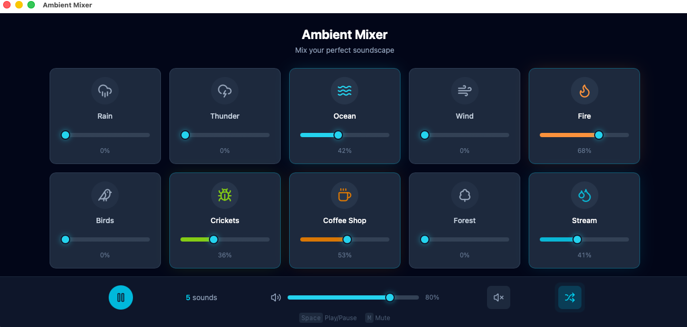

# Ambient Mixer

A beautiful ambient noise mixer for relaxation and focus. Mix different background sounds like rain, thunder, ocean waves, fire, birds, and more to create your perfect soundscape.



## Features

- **10 Ambient Sounds**: Rain, Thunder, Ocean, Wind, Fire, Birds, Crickets, Coffee Shop, Forest, Stream
- **Individual Volume Control**: Adjust each sound independently
- **Master Volume & Mute**: Global audio controls
- **Meander Mode**: Automatic gentle volume fluctuations for a more natural feel
- **Keyboard Shortcuts**: Space (Play/Pause), M (Mute)
- **PWA Support**: Install as a web app, works offline
- **Desktop App**: Native macOS and Windows apps via Tauri
- **Window State Memory**: Remembers window position and size

## Quick Start

### Web Development

```bash
# Install dependencies
npm install

# Start development server
npm run dev

# Build for production
npm run build
```

### Desktop App (Tauri)

```bash
# Development with hot reload
npm run tauri:dev

# Build for production
npm run tauri:build
```

**Requirements for Tauri:**
- [Node.js](https://nodejs.org/) (v18+)
- [Rust](https://rustup.rs/)
- Platform-specific dependencies (see [Tauri Prerequisites](https://tauri.app/start/prerequisites/))

## Tech Stack

- **Frontend**: React 18, Vite, Tailwind CSS v4
- **Audio**: Web Audio API with seamless looping
- **Icons**: Lucide React
- **PWA**: Vite PWA Plugin with Workbox
- **Desktop**: Tauri v2

## Architecture

```
src/
├── components/       # React components (SoundCard, VolumeSlider, etc.)
├── context/          # Audio state management (AudioContext.jsx)
├── hooks/            # Custom hooks
│   ├── useAudioEngine.js   # Web Audio API wrapper with LRU caching
│   └── useMeander.js       # Volume fluctuation animations
├── data/             # Sound definitions
└── utils/            # Utility functions (easing, animations)
```

### Audio System

The app uses Web Audio API for high-quality playback:
- **AudioContext**: Manages audio graph and state
- **LRU Buffer Cache**: Limits memory usage by caching only 3 most recent sounds
- **Smooth Transitions**: Volume changes use linear ramping to avoid clicks

## Building for Different Platforms

### macOS
```bash
npm run tauri:build
# Output: src-tauri/target/release/bundle/dmg/
```

### Windows
Build on a Windows machine:
```bash
npm run tauri:build
# Output: src-tauri/target/release/bundle/nsis/
```

Or use GitHub Actions for automated cross-platform builds.

## License

MIT

## Acknowledgments

Inspired by [A Soft Murmur](https://asoftmurmur.com/)
